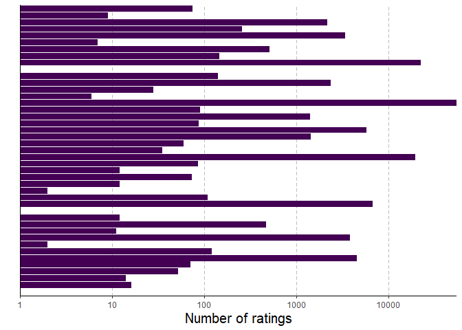
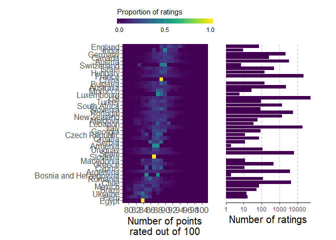

Week22\_Wine
================

# Setup

``` r
library(tidyverse)
library(ggrepel)
library(scales)
library(RColorBrewer)
library(ggridges)
library(viridis)
library(egg)

# Read in data
wine_data <- read_csv("https://raw.githubusercontent.com/rfordatascience/tidytuesday/master/data/2019/2019-05-28/winemag-data-130k-v2.csv")
```

# Clean data

``` r
wine_data <- wine_data %>%
  
  # filter out country == NA
  filter(!is.na(country)) %>%

  # compute intervals
  mutate(interval = cut(points, breaks = seq(1,100, by = 0.25))) 
```

# Calculate density

…over wine ratings grouped by country

``` r
# first calculate sum of counts for each coutnry
sum_by_country <- wine_data %>%
  group_by(country) %>%
  summarize(sum_of_counts = n()) 

# calulate count per interval, then divide by total
sum_by_country_by_interval <- wine_data %>%
  group_by(country, interval) %>%
  summarize(counts = n()) %>%
  left_join(sum_by_country) %>%
  mutate(prop_counts = counts/sum_of_counts) 
```

    ## Joining, by = "country"

``` r
# need to calculate midpoints for each interval
# taken from  https://www.r-bloggers.com/finding-the-midpoint-when-creating-intervals/
midpoints <- function(x, dp=4){
  lower <- as.numeric(gsub(',.*','',gsub('\\(|\\[|\\)|\\]', '', x)))
  upper <- as.numeric(gsub('.*,','',gsub('\\(|\\[|\\)|\\]','', x)))
  return(round(lower+(upper-lower)/2, dp))
}
  
sum_by_country_by_interval <- sum_by_country_by_interval %>%
  mutate(points = midpoints(interval))
```

# Plotting

Let’s organize the rows by their points median

``` r
order_of_countries <- wine_data %>%
  group_by(country) %>%
  summarize(ave_points = median(points)) %>%
  arrange(ave_points) %>%
  pull(country)


plot1 <- sum_by_country_by_interval %>%
  ungroup() %>%
  mutate(country = factor(country, levels = order_of_countries)) %>%
  ggplot(aes(x = points, y = country, fill = prop_counts)) +
  geom_tile() +
  scale_x_continuous(breaks = scales::pretty_breaks(n = 10)) +
  scale_fill_viridis(na.value = viridis(100)[1],
                     limits = c(0,1), breaks = c(0.0,0.5,1), 
                     guide = guide_colorbar(title.position = 'top',
                                            barwidth = 10,
                                            barheight = 0.5)) +
  theme(panel.background = element_rect(fill=viridis(100)[1],
                                        colour=viridis(100)[1]),
        panel.grid = element_blank(),
        axis.text.x = element_text(size=13),
        axis.text.y = element_text(size=12),
        axis.title.x = element_text(size=15),
        legend.position = 'top') +
  coord_equal() +
  labs(fill = 'Proportion of ratings', y = '', x = 'Number of points\nrated out of 100')
plot1
```

<!-- -->

Some countries have really narrow distributions. Is it because there
were only a few ratings or a few wines for that country? Or is their
unanimous agreement.

``` r
plot2 <- wine_data %>% count(country) %>%
  mutate(country = factor(country, levels = order_of_countries)) %>%
  ggplot(aes(x = country, y = n)) +
  geom_bar(stat = 'identity', fill = viridis(100)[1]) +
  scale_y_log10(expand = c(0,0),
                breaks = c(1,10,100,1000,10000)) +
  theme_classic() +
  theme(axis.ticks.y = element_blank(),
        axis.text.y = element_blank(),
        panel.grid.major.x= element_line(color = 'grey', 
                                         lineend = 'round',
                                         linetype = 'dashed'),
        axis.title.x = element_text(size = 15)) +
  coord_flip() +
  labs(y = 'Number of ratings', x = '')
plot2
```

<!-- -->

put em together

``` r
plot3 <- egg::ggarrange(plot1, plot2, nrow = 1)
```

<!-- -->

Save
plot

``` r
png('plots/week22_wine.png', units = 'in', height = 14, width = 12, res = 300)
print(plot3)
dev.off()
```
