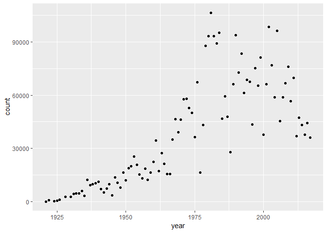
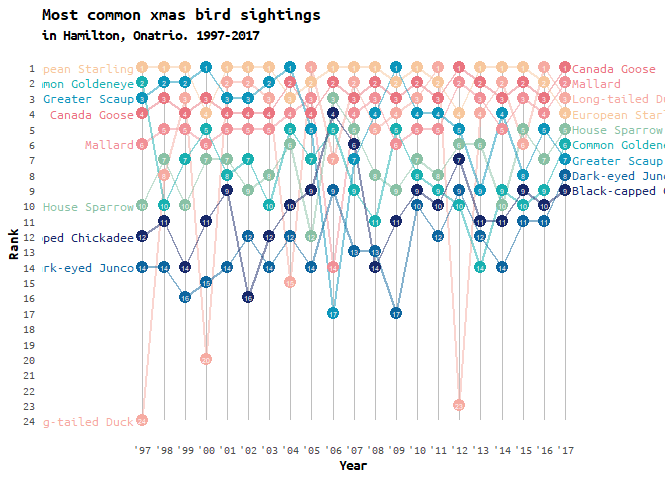

Week 25 Bird Counting
================
Victor Yuan
07/06/2019

I have previously seen someone make a very nice ‘bump’ plot (which I did
not know that was the name of the type of plot I saw at the time). I
haven’t been able to find that plot in my mind, I think it was probably
from someone from [The Pudding](https://pudding.cool/). Anyways, this
TidyTuesday I thought it would be cool to try that type of visualization
out.

After some googling I found some blog posts that I helped me get started
on the plot code:

1.  [dog breeds](https://luisdva.github.io/rstats/dog-bump-chart/)
2.  [bump chart](https://dominikkoch.github.io/Bump-Chart/)

# Setup

``` r
library(tidyverse)
library(RColorBrewer)
library(LaCroixColoR)
library(extrafont)
loadfonts(device = "win")

# Read in data
bird_counts <- readr::read_csv("https://raw.githubusercontent.com/rfordatascience/tidytuesday/master/data/2019/2019-06-18/bird_counts.csv")
```

Initial exploratory work quickly made me realize that I need to focus on
a few select species, otherwise the plot will be overcrowded:

``` r
bird_counts %>% glimpse()
```

    ## Observations: 18,706
    ## Variables: 6
    ## $ year                     <dbl> 1921, 1921, 1921, 1921, 1921, 1921, 1...
    ## $ species                  <chr> "American Bittern", "American Black D...
    ## $ species_latin            <chr> "Botaurus lentiginosus", "Anas rubrip...
    ## $ how_many_counted         <dbl> 0, 0, 0, 0, 0, 0, 0, 1, 0, 12, 0, 0, ...
    ## $ total_hours              <dbl> 8, 8, 8, 8, 8, 8, 8, 8, 8, 8, 8, 8, 8...
    ## $ how_many_counted_by_hour <dbl> 0.000, 0.000, 0.000, 0.000, 0.000, 0....

``` r
bird_counts %>%
  group_by(year) %>%
  mutate(count = sum(how_many_counted)) %>%
  ggplot(aes(x = year, y = count, group = year)) +
  geom_point()
```

<!-- -->

I decide to filter to the 9 most abundant species in the most recent
year. I chose 9 because that’s the maximum number of categories for
discrete color scales in th Rcolorbrewer package.

``` r
# create ranking per year
bird_counts_rank <- bird_counts %>%
  arrange(year, desc(how_many_counted)) %>%
  group_by(year) %>%
  mutate(year_rank = row_number()) %>%
  ungroup()

# get vector of top 9 species in year 2017
top9 <- bird_counts_rank %>%
  filter(year == 2017) %>% filter(year_rank < 10) %>%
  pull(species)
```

After testing a few things out I decided to look at the top 9 species
found in the latest year (2017). This is, again, to avoid overcrowding
of the plots.

``` r
# create color code
others <- setdiff(bird_counts_rank$species %>% unique, top9)
color_code <- setNames(c(brewer.pal(9, "Set1"), rep('grey', length(others))),
                       c(top9, others))
# font
font <- 'Ubuntu Mono'

# past n-1 years to visualize
nyear <- 21

bird_counts_rank %>% 
  
  # filter to top 9
  filter(species %in% top9,
         year > 2017-nyear) %>%
  
  # relevel on order of top 9 in 2017
  mutate(species = factor(species, levels = top9)) %>% 
  
  {
    ggplot(., aes(x = year, y = year_rank, color = species)) +
      # geom segement for fake gridlines
      geom_segment(data = ., aes(x = year, xend = year,
                                 y = min(.$year_rank), yend = max(.$year_rank)),
                   color = 'grey', alpha = 0.7) +
      
      # basics
      geom_line(size = 1, alpha = 0.5) +
      geom_point(size = 4) +
      geom_text(color = 'white', aes(label = year_rank), size = 1.75) +
      
      # labels for left and right of lines
      geom_text(data =  . %>% filter(year == min(year)),
                aes(label = species, x = min(.$year)-0.5, color = species) , 
                hjust = 'right', nudge_x = 0.1, family = font, size = 3.5) +
      geom_text(data =  . %>% filter(year == max(year)),
                aes(label = species, x = max(.$year)-0.5, color = species) , 
                hjust = 'left', nudge_x = 0.85, family = font, size = 3.5) +

      # x axis
      scale_x_continuous(expand = c(0.2,0.2),
                         breaks = (2017-(nyear-1)):2017,
                         labels = gsub('^[0-9]{2}', "'", as.character((2017-(nyear-1)):2017))) +
      
      # other stuff
      #scale_color_brewer(palette = 'Dark2')  +
      scale_color_manual(values = lacroix_palette("Pamplemousse", 9)) +
      scale_y_reverse(breaks = 1:max(.$year_rank)) +
      theme_bw() +
      theme(panel.grid.major.y = element_blank(),
            panel.grid.minor.y = element_blank(),
            panel.grid.major.x = element_blank(),
            panel.grid.minor.x = element_blank(),
            panel.border = element_blank(),
            axis.ticks = element_blank(),
            axis.title = element_text(face = 'bold'),
            legend.position = '',
            title = element_text(face = 'bold'),
            text = element_text(family = font)) +
      labs(x = 'Year', y = 'Rank', 
           title = 'Most common bird sightings',
           subtitle = 'in Hamilton, Onatrio. 1997-2017')
    }
```

<!-- -->

``` r
ggsave('plots/week25_birds.png', dpi = 300)
```

**Lessons learned:**

*1. Bump plots are really hard to read unless you are working with less
than 10 groups*

Although probably if you wanted to highlight less than 10 groups in a
largr group, that would be pretty cool too.

*2. fonts can be easily customized after some setup with extrafont*

if I had more time, I would want to try to use gganimate to highlight a
single species per frame, over all years.
